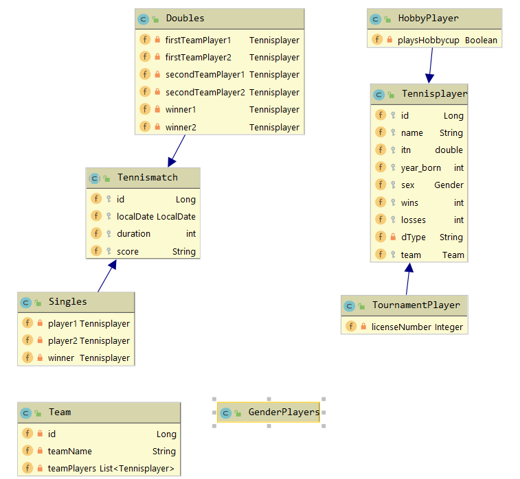

# Julian Nobis - Quarkus - Tennis Project
## Beschreibung:
Ein Quarkus JPA-Projekt zur <strong>Administration von Tennisspielern</strong> in einem Tennisclub.<br>Ein Tennisspieler kann entweder ein <strong>Turnierspieler</strong> (mit einer zusätzlichen <strong>Lizenznummer</strong>), oder ein <strong>Hobbyspieler</strong> (hat eine Berechtigung für den sog. <strong>'Hobbycup'</strong>) sein. <br>Ein Tennisclub kann mehrere <strong>Teams</strong> (= Mannschaften, welche in der sog. 'Meisterschaft' offizielle Matches gegen andere Mannschaften bestreiten) bereitstellen.<br>Clubintern können die <strong>Spieler</strong> selbstverständlich auch <strong>gegeneinander spielen</strong>, diese Matches (<strong>Singles</strong> oder <strong>Doubles</strong>) werden bei den jeweiligen Spielern mitgespeichert. 

## Bestandteile des Projekts

## CLD


### Quarkus
So kann Quarkus im Dev-Mode gestartet werden. Ebenfalls wurde die 'resteasy-jsonb' Extension hinzugefügt.
````
./mvnw compile quarkus:dev:
./mvnw quarkus:add-extension -Dextensions="resteasy-jsonb"
````

### Datenbank
Ich habe mich für eine <strong>Postgres</strong> Datenbank (in Docker) entschieden.
````
docker pull postgres
docker run -e POSTGRES_PASSWORD=passme -e POSTGRES_USER=postgres -e POSTGRES_DB=mydatabase -d -p 5432:5432 postgres
````

## REST API

### PlayerEndpoint
#### GET

#### GET{id}

#### GET BEST PLAYER

#### DELETE{id}

### TeamEndpoint
#### GET

#### GET{id}

#### DELETE{id}

#### POST

### MatchEndpoint
#### GET

#### GET{id}

#### GET ALL SINGLES

#### GET ALL DOUBLES

#### GET SINGLE{id}

#### GET DOUBLE{id} 
